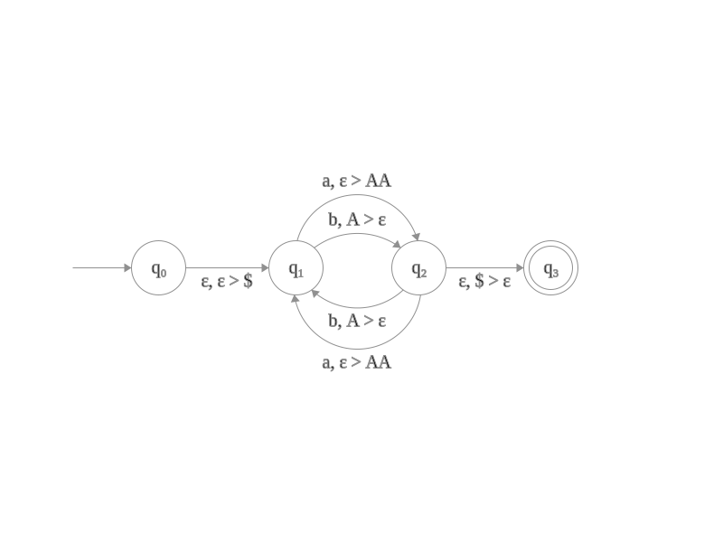
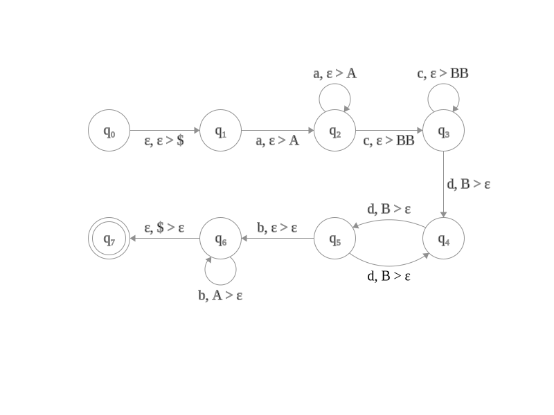

# Automi a pila

Un automa a pila è una sestupla $\langle Q,\Sigma, \Gamma , \gamma , q_0, F \rangle$, dove
- $Q$ è l'insieme degli stati
- $\Sigma$ è l'alfabeto
- $\Gamma$ è l'alfabeto della pila
- $\delta: Q\times (\Sigma\cup\{\varepsilon\})\times(\Gamma\cup\{\varepsilon\})\to (Q\times (\Gamma\cup\{\varepsilon\}))^p$
- $q_0\in Q$ è lo stato iniziale
- $F\subseteq Q$ è l'insieme degli stati di accettazione

---

$$L=\{a^nb^{2n}:n\geq 1, n\ dispari\}$$

$$L=\{a^N c^n d^{2n}b^{N+1}: N,n >0\}$$

