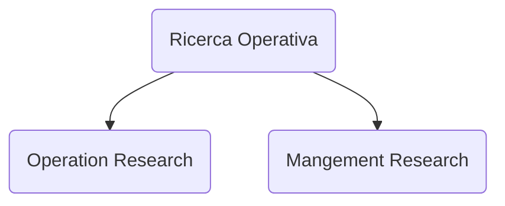

# Ricerca operativa

Esame
- Scritto numerico, minimo 18/30, peso: 80% del totale
- Scritto teorico, minimo 6/10, peso: 20% del totale, -0.2 per una domanda sbagliata

Argomenti
- [[Problema decisionale]]
- [[Programmazione lineare]] $PL$
    - [[Algoritmo del simplesso]]
- [[Dualità|Teoria della dualità]] $D$
- [[Programmazione lineare intera]] $PLI$
    - [[Problema dello zaino]] $Z$
- [[Problema di flusso a costo minimo]] $PFCM$
    - [[Problema del cammino di costo minimo]] $PCCM$
    - [[Problema del massimo flusso]] $PMF$
        - [[Duale del problema di massimo flusso]] $D\ di\ PMF$