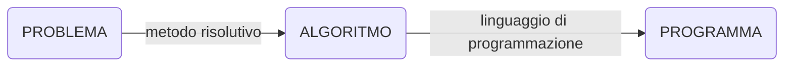

# Programmazione

La programmazione è l'attività secondo cui si istruisce l'elaboratore ad eseguire un determinato compito, su una particolare tipologia di dati, allo scopo di risolvere un problema. I programmi costruiti per risolvere problemi hanno una campo di applicazione generale, per cui i dati in ingresso sono variabili e costituiscono l'**input**, dopo aver calcolato l'elaboratore fornisce l'**output** che è la soluzione al problema.

La *specifica* del problema non è sufficiente a trovare la soluzione, almeno nella **programmazione imperativa**. In quella dichiarativa è invece utile la specifica.

==Algoritmo== è una sequenza finita di passi che risolve in un tempo finito un problema.

==Codifica== è la fase di scrittura di un algoritmo attraverso un esame ordinato di **fasi** (*istruzioni*), scritte in un determinato **linguaggio di programmazione**, che specificano le **azioni** da compiere.

==Programma== è un **testo** scritto in accordo alla **sintassi** e alla **semantica** di un linguaggio di programmazione.

Sintassi: regole che consentono di scrivere parole e frasi riconoscibili come appartenenti a un determinato linguaggio.

Semantica: disciplina che studia il significato di parole e frasi.

Linguaggi ad alto livello.

Un algoritmo si può rappresentare anche attraverso **pseudocodice** o diagrammi di flusso.

Esempio

Calcolare il [[mcd-mcm|MCD]] fra due interi M ed N

Algoritmo I
1. Calcola l'insieme A dei divisori di M
2. Calcola l'insieme B dei divisori di N
3. Calcola l'insieme C dei.divisori comuni $A\cap B$
4. Il risultato è il massimo dell'insieme C

Questa non è una soluzione ottimale, meglio l'algoritmo di Euclide. Prendere dalle slides.
