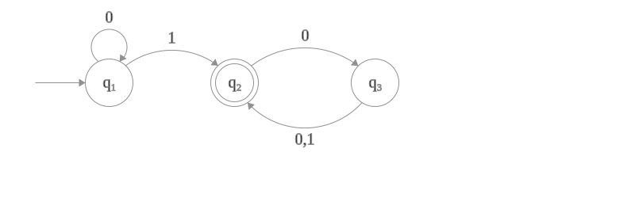
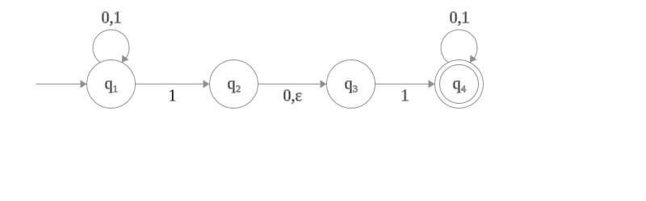

# Automi a stati finiti

Un **automa a stati finiti** è una quintupla $\langle\ Q,\Sigma,\delta, q_0, F\ \rangle$

- $Q$ è l'**insieme degli stati** (*finito*, non vuoto)
- $\Sigma$ è un **alfabeto** (finito, non vuoto)
- $\delta : Q \times \Sigma \mapsto Q$ è la funzione di transizione
- $q_0\in Q$ è lo **stato iniziale**
- $F\subseteq Q$ è l'**insieme degli stati di accettazione**

L'automa legge una stringa in *input*. Ogni carattere comporta una transizione di stato. Se quando si giunge all'ultimo carattere della stringa l'automa si trova su uno stato di accettazione, questo vuol dire che l'automa accetta la stringa, ovvero: *la riconosce*. Se così non è l'automa rifiuta la stringa.

Un automa può essere descritto tramite la **matrice di transizione** o tramite **il diagramma degli stati**, in cui:
- uno stato è rappresentato da un nodo
- una transizione tra stati è indicata da un arco etichettato con l'input
- gli stati di accettazione hanno un doppio bordo

---

Gli automi a stati finiti deterministici accettano **linguaggi regolari** (tipo 3).

Per capire meglio gli automi a stati finiti li si può associare ad una grammatica lineare destra, così da avere una grammatica del tipo $\langle \Sigma,Q,q_1,P \rangle$, dove:
- $\Sigma$ è l'alfabeto (insieme dei caratteri che l'automa riconosce) corrispondente ai *simboli terminali* della grammatica $V_T$
- $Q$ (insieme degli stati) corrisponde ai simboli non terminali $V_N$
- $q_1$ (stato iniziale) corrisponde al simbolo iniziale $S$
- $P$ (regole di produzione) corrisponde agli stati di accettazione e alla matrice di transizione.

> [!important] Determinismo e non determinismo
> Un automa a stati finiti è **deterministico** se ogni passo della computazione di una stringa segue univocamente il passo precedente. O meglio, alla lettura di ciascun simbolo corrisponde una sola transizione.
> Una macchina che consente la transizione ad un nuovo stato in più di un modo è una macchina **non deterministica**.
> Ogni automa deterministico è anche non deterministico.

> [!note] Un automa a stati finiti deterministico si denota con $AFD$, mentre un automa a stati finiti non deterministico si denota con $AFN$.

In un $AFN$ ci può essere più di un arco con la stessa etichetta uscente da uno stato. In più per gli $AFN$ è consentito avere un arco con $\varepsilon$ (stringa vuota), mentre per gli $AFD$ questo non è possibile.

---

Esempio di $AFD$

$$AFD=\langle\{q_1,q_2,q_3\},\{0,1\},\delta,q_1,\{q_2\}\rangle$$

$\delta$ è definita dalla matrice di transizione

|       |   $0$ |  $1$  |
|:-----:| -----:|:-----:|
| $q_1$ | $q_1$ | $q_2$ |
| $q_2$ | $q_3$ | $q_2$ |
| $q_3$ | $q_2$ | $q_2$ |

---

Esempio di $AFN=\langle\{q_1,q_2,q_3,q_4\},\{0,1\},\delta,q_1\in Q,\{q_4\}\rangle$

$\delta$ è dato dalla matrice di transizione

|       |      $0$      |      $1$       | $\varepsilon$ |
|:-----:|:-------------:|:--------------:|:-------------:|
| $q_1$ |   $\{q_1\}$   | $\{q_1,q_21\}$ | $\varnothing$ |
| $q_2$ |   $\{q_3\}$   | $\varnothing$  |   $\{q_3\}$   |
| $q_3$ | $\varnothing$ |   $\{q_4\}$    | $\varnothing$ |
| $q_4$ |   $\{q_4\}$   |   $\{q_4\}$    | $\varnothing$ |

Dallo stato $q_1$ di questo automa escono due archi con $1$.

La natura non deterministica dell'automa fa si che se la computazione e in $q_1$ e si legge $1$ si va contemporaneamente in $\{q_1,q_2\}$, *parallelamente*.

(per disegnare macchine a stati finiti: https://madebyevan.com/fsm/)
