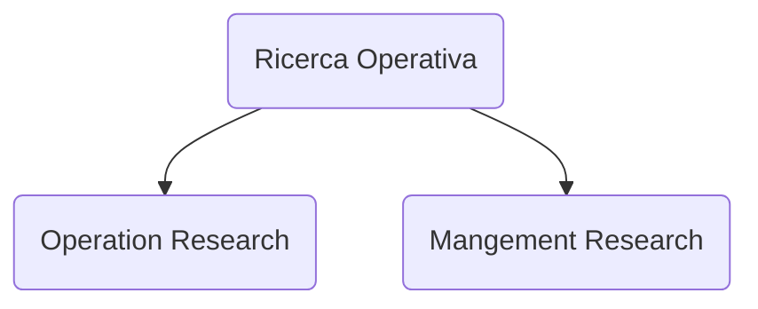

# Ricerca operativa

Esame
- Scritto numerico, minimo 18/30, peso: 80% del totale
- Scritto teorico, minimo 6/10, peso: 20% del totale, -0.2 per una domanda sbagliata

Argomenti
- [[problema-decisionale|Problema decisionale]]
- [[programmazione-lineare|Programmazione lineare]] $PL$
    - [[simplesso|Algoritmo del simplesso]]
- [[dualita|Teoria della dualità]] $D$
- [[programmazione-lineare-intera|Programmazione lineare intera]] $PLI$
    - [[zaino|Problema dello zaino]] $Z$
- [[flusso-costo-minimo|Problema di flusso a costo minimo]] $PFCM$
    - [[cammino-costo-minimo|Problema di cammino di costo minimo]] $PCCM$
    - [[massimo-flusso|Problema di massimo flusso]] $PMF$
        - [[massimo-flusso-duale|Duale del problema di massimo flusso]] $D\ di\ PMF$