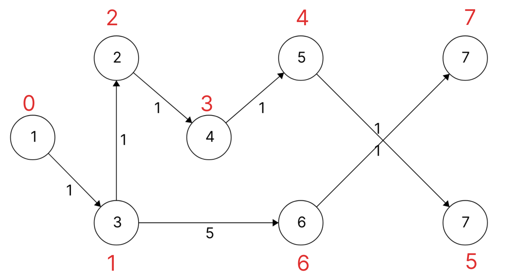

# 13 novembre 2023

<?xml version="1.0" standalone="no"?>
<!DOCTYPE svg PUBLIC "-//W3C//DTD SVG 1.1//EN" "https://www.w3.org/Graphics/SVG/1.1/DTD/svg11.dtd">

<svg width="700" height="320" version="1.1" xmlns="http://www.w3.org/2000/svg">
	<ellipse stroke="black" stroke-width="1" fill="none" cx="78.5" cy="170.5" rx="30" ry="30"/>
	<text x="75.5" y="176.5" font-family="Times New Roman" font-size="20">1</text>
	<ellipse stroke="black" stroke-width="1" fill="none" cx="191.5" cy="63.5" rx="30" ry="30"/>
	<text x="186.5" y="69.5" font-family="Times New Roman" font-size="20">2</text>
	<ellipse stroke="black" stroke-width="1" fill="none" cx="191.5" cy="285.5" rx="30" ry="30"/>
	<text x="186.5" y="291.5" font-family="Times New Roman" font-size="20">3</text>
	<ellipse stroke="black" stroke-width="1" fill="none" cx="316.5" cy="170.5" rx="30" ry="30"/>
	<text x="311.5" y="176.5" font-family="Times New Roman" font-size="20">4</text>
	<ellipse stroke="black" stroke-width="1" fill="none" cx="440.5" cy="63.5" rx="30" ry="30"/>
	<text x="435.5" y="69.5" font-family="Times New Roman" font-size="20">5</text>
	<ellipse stroke="black" stroke-width="1" fill="none" cx="440.5" cy="285.5" rx="30" ry="30"/>
	<text x="435.5" y="291.5" font-family="Times New Roman" font-size="20">6</text>
	<ellipse stroke="black" stroke-width="1" fill="none" cx="662.5" cy="63.5" rx="30" ry="30"/>
	<text x="657.5" y="69.5" font-family="Times New Roman" font-size="20">7</text>
	<ellipse stroke="black" stroke-width="1" fill="none" cx="662.5" cy="285.5" rx="30" ry="30"/>
	<text x="657.5" y="291.5" font-family="Times New Roman" font-size="20">7</text>
	<polygon stroke="black" stroke-width="1" points="100.284,149.873 169.716,84.127"/>
	<polygon fill="black" stroke-width="1" points="169.716,84.127 160.47,85.997 167.345,93.258"/>
	<text x="140.5" y="137.5" font-family="Times New Roman" font-size="20">3</text>
	<polygon stroke="black" stroke-width="1" points="99.526,191.898 170.474,264.102"/>
	<polygon fill="black" stroke-width="1" points="170.474,264.102 168.433,254.891 161.3,261.9"/>
	<text x="123.5" y="248.5" font-family="Times New Roman" font-size="20">1</text>
	<polygon stroke="black" stroke-width="1" points="213.578,265.188 294.422,190.812"/>
	<polygon fill="black" stroke-width="1" points="294.422,190.812 285.149,192.548 291.92,199.908"/>
	<text x="259.5" y="248.5" font-family="Times New Roman" font-size="20">4</text>
	<polygon stroke="black" stroke-width="1" points="214.291,83.009 293.709,150.991"/>
	<polygon fill="black" stroke-width="1" points="293.709,150.991 290.883,141.991 284.38,149.587"/>
	<text x="242.5" y="137.5" font-family="Times New Roman" font-size="20">1</text>
	<polygon stroke="black" stroke-width="1" points="191.5,255.5 191.5,93.5"/>
	<polygon fill="black" stroke-width="1" points="191.5,93.5 186.5,101.5 196.5,101.5"/>
	<text x="196.5" y="180.5" font-family="Times New Roman" font-size="20">1</text>
	<polygon stroke="black" stroke-width="1" points="221.5,63.5 410.5,63.5"/>
	<polygon fill="black" stroke-width="1" points="410.5,63.5 402.5,58.5 402.5,68.5"/>
	<text x="310.5" y="84.5" font-family="Times New Roman" font-size="20">4</text>
	<polygon stroke="black" stroke-width="1" points="221.5,285.5 410.5,285.5"/>
	<polygon fill="black" stroke-width="1" points="410.5,285.5 402.5,280.5 402.5,290.5"/>
	<text x="311.5" y="306.5" font-family="Times New Roman" font-size="20">5</text>
	<polygon stroke="black" stroke-width="1" points="339.213,150.901 417.787,83.099"/>
	<polygon fill="black" stroke-width="1" points="417.787,83.099 408.464,84.54 414.997,92.111"/>
	<text x="383.5" y="137.5" font-family="Times New Roman" font-size="20">1</text>
	<polygon stroke="black" stroke-width="1" points="470.5,63.5 632.5,63.5"/>
	<polygon fill="black" stroke-width="1" points="632.5,63.5 624.5,58.5 624.5,68.5"/>
	<text x="546.5" y="84.5" font-family="Times New Roman" font-size="20">7</text>
	<polygon stroke="black" stroke-width="1" points="662.5,93.5 662.5,255.5"/>
	<polygon fill="black" stroke-width="1" points="662.5,255.5 667.5,247.5 657.5,247.5"/>
	<text x="646.5" y="180.5" font-family="Times New Roman" font-size="20">8</text>
	<polygon stroke="black" stroke-width="1" points="470.5,285.5 632.5,285.5"/>
	<polygon fill="black" stroke-width="1" points="632.5,285.5 624.5,280.5 624.5,290.5"/>
	<text x="546.5" y="306.5" font-family="Times New Roman" font-size="20">2</text>
	<polygon stroke="black" stroke-width="1" points="461.713,264.287 641.287,84.713"/>
	<polygon fill="black" stroke-width="1" points="641.287,84.713 632.094,86.835 639.165,93.906"/>
	<text x="539.5" y="165.5" font-family="Times New Roman" font-size="20">1</text>
	<polygon stroke="black" stroke-width="1" points="461.713,84.713 641.287,264.287"/>
	<polygon fill="black" stroke-width="1" points="641.287,264.287 639.165,255.094 632.094,262.165"/>
	<text x="539.5" y="195.5" font-family="Times New Roman" font-size="20">1</text>
	<polygon stroke="black" stroke-width="1" points="418.504,265.1 338.496,190.9"/>
	<polygon fill="black" stroke-width="1" points="338.496,190.9 340.962,200.006 347.762,192.674"/>
	<text x="383.5" y="219.5" font-family="Times New Roman" font-size="20">6</text>
</svg>

I numeri sugli archi sono il costo di passaggio.

## Cammino minimo calcolato da $1$ a tutti gli altri nodi

$$PL \begin{cases}
\underset f \min z = & 3f_{1,2} + f_{1,3} + f_{2,4} + 4f_{2,5} + f_{3,2} + 4f_{3,4} + 5 f_{3,6} + \\ & + f_{4,5} + 7f_{5,7} + f_{5,8} + 6f_{6,4} + f_{6,7} + 2f_{6,8} + 8f_{7,8} \\
\\
& f_{1,2} + f_{1,3} = |V| - 1 = 7 \\
& f_{2,4} + f_{2,5} - f_{1,2} - f_{3,2} = -1 \\
& f_{3,2} + f_{3,4} + f_{3,6} - f_{1,3} = -1 \\
& f_{4,5} - f_{2,4} + f_{3,4} - f_{6,4} = -1 \\
& f_{5,7} + f_{5,8} - f_{2,5} - f_{4,5} = -1 \\
& f_{6,4} + f_{6,7} - f_{3,6} - f_{6,8} = -1 \\
& f_{7,8} - f_{5,7} - f_{5,8} = -1 \\
& -f_{5,8} - f_{6,8} - f_{7,8} = -1 \\
\\
& f \geq 0

\end{cases}$$

| $w,\rho$            | $1$ |    $2$    |    $3$    |    $4$    |    $5$    |    $6$    |    $7$    |    $8$    |
| ------------------- |:---:|:---------:|:---------:|:---------:|:---------:|:---------:|:---------:|:---------:|
| $\varnothing$       | $0$ | $+\infty$ | $+\infty$ | $+\infty$ | $+\infty$ | $+\infty$ | $+\infty$ | $+\infty$ |
| $\{1\}$             | $0$ |    $3$    |    $1$    | $+\infty$ | $+\infty$ | $+\infty$ | $+\infty$ | $+\infty$ |
| $\{1,3\}$           | $0$ |    $2$    |    $1$    |    $5$    | $+\infty$ |    $6$    | $+\infty$ | $+\infty$ |
| $\{1,3,2\}$         | $0$ |    $2$    |    $1$    |    $3$    |    $6$    |    $6$    | $+\infty$ | $+\infty$ |
| $\{1,3,2,4\}$       | $0$ |    $2$    |    $1$    |    $3$    |    $4$    |    $6$    | $+\infty$ | $+\infty$ |
| $\{1,3,2,4,5\}$     | $0$ |    $2$    |    $1$    |    $3$    |    $4$    |    $6$    |   $11$    |    $5$    |
| $\{1,3,2,4,5\}$     | $0$ |    $2$    |    $1$    |    $3$    |    $4$    |    $6$    |   $11$    |    $5$    |
| $\{1,3,2,4,5,8\}$   | $0$ |    $2$    |    $1$    |    $3$    |    $4$    |    $6$    |   $11$    |    $5$    |
| $\{1,3,2,4,5,8,6\}$ | $0$ |    $2$    |    $1$    |    $3$    |    $4$    |    $6$    |   $11$    |    $5$    |
| $w=v$               | $0$ |    $2$    |    $1$    |    $3$    |    $4$    |    $6$    |   $11$    |    $5$    |

Si ha il risultato al nodo 5.

---

| Predecessore | $1$ | $2$         | $3$ | $4$         | $5$         | $6$         | $7$         | $8$         |
| ------------ | --- | ----------- | --- | ----------- | ----------- | ----------- | ----------- | ----------- |
|              | $1$ | $\cancel 1$ | $1$ | $\cancel 1$ | $\cancel 1$ | $\cancel 1$ | $\cancel1$  | $\cancel 1$ |
|              |     | $3$         |     | $\cancel 3$ | $\cancel 2$ | $3$         | $\cancel 5$ | $5$         |
|              |     |             |     | $2$         | $4$         |             | $6$         |             |

Albero dei cammini minimi:

Qui $0$ è $\rho(1)$, $2$ è $\rho(2)$, ecc.

Divergenze:

$$PL \begin{cases}
f^*_{5,8} = f^*_{6,7}= 1 \\
f^*_{1,3} = 7 \\
f^*_{4,5} = 2 \\
f^*_{2,4} = 3 \\
f^*_{3,2} = 4 \\
f^*_{3,6} = 2 \\
Tutti\ gli\ altri\ flussi\ sono\ nulli \\
\\
z^* = 1 \cdot 7 + 1 \cdot 4 + 1 \cdot 3 + \cdot 2 + 1 \cdot 1 + 5 \cdot 2 + 1 \cdot 1 = 28
\end{cases}$$

$$Da\ 1\ a\ 5 \begin{cases}
f^*_{1,3} = f^*_{3,2} = f^*_{2_4} = f^*_{4,5} = 1\\
Gli\ altri = 0 \\
\\
z^* = \rho(5) = 4
\end{cases}$$